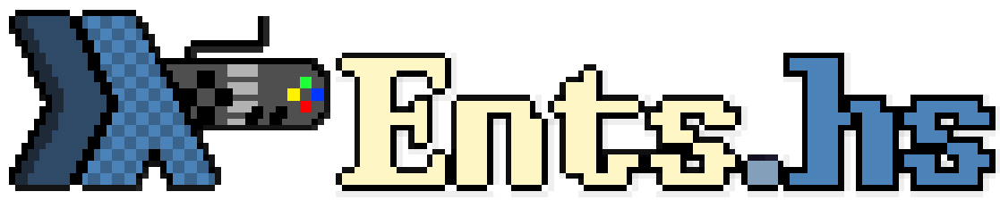
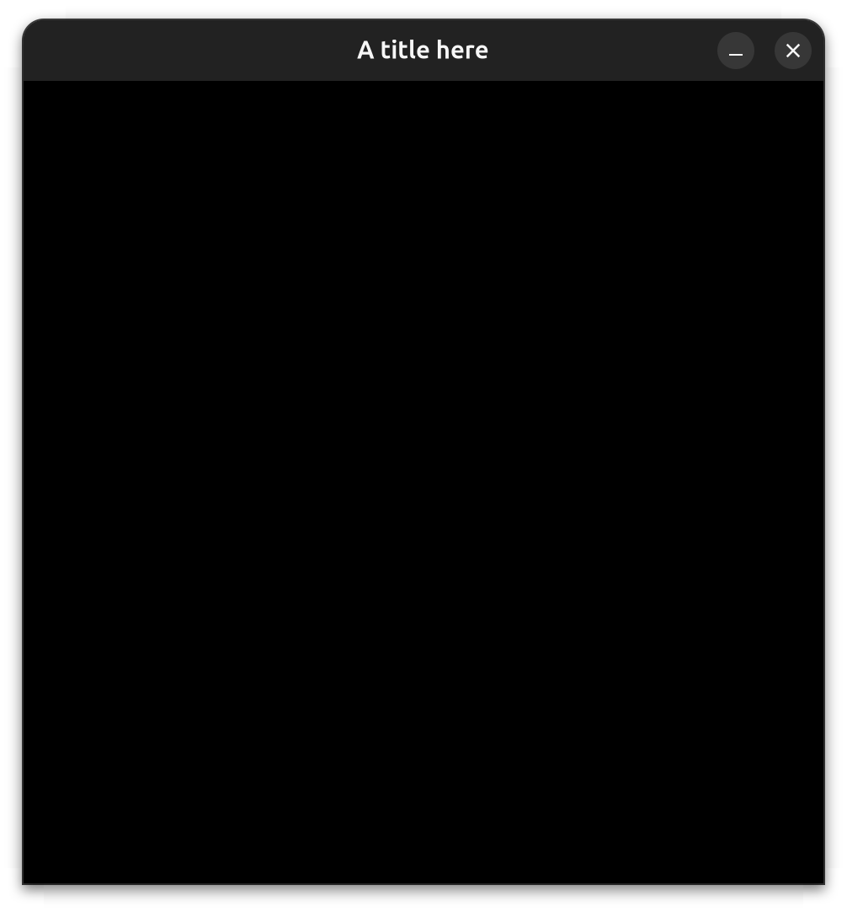
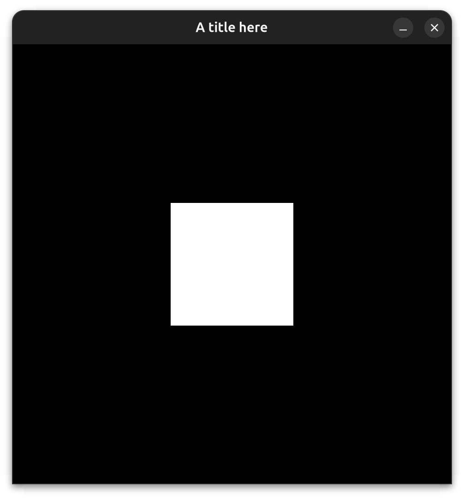
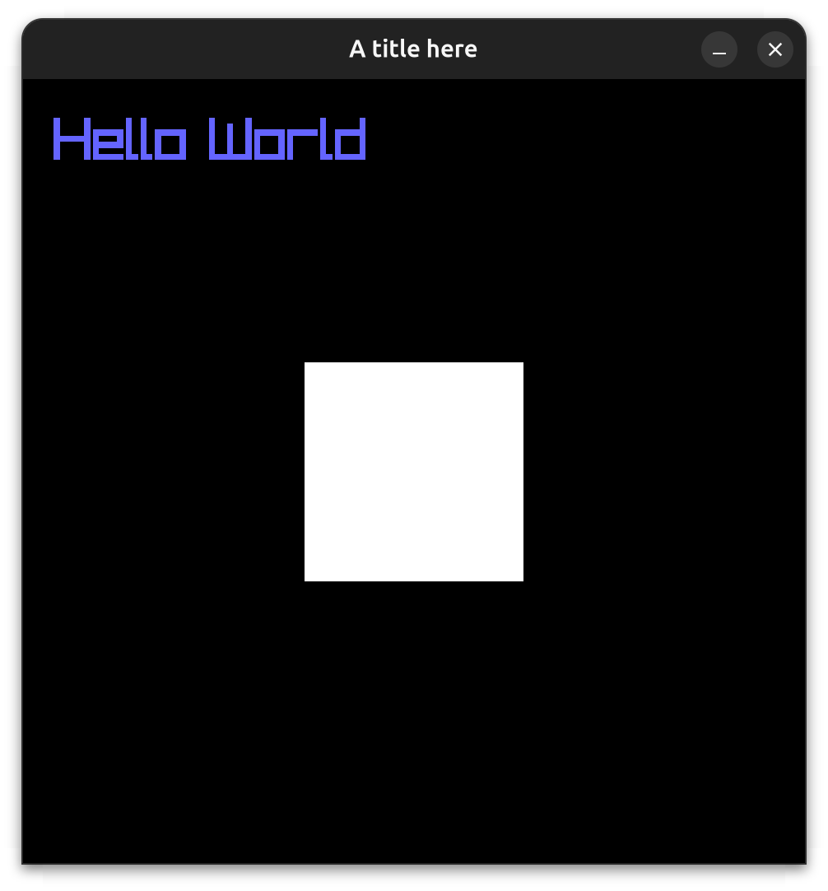
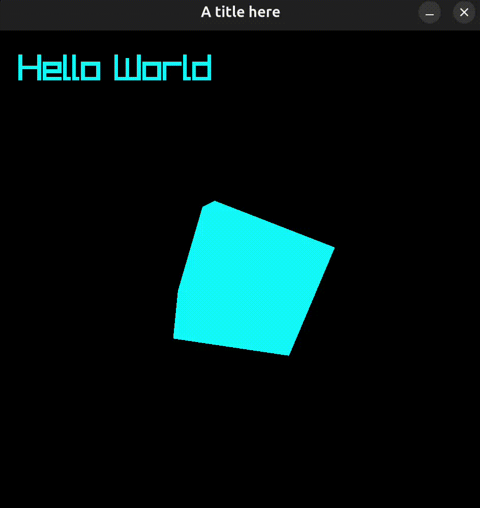
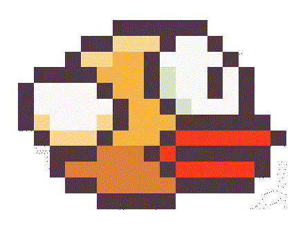
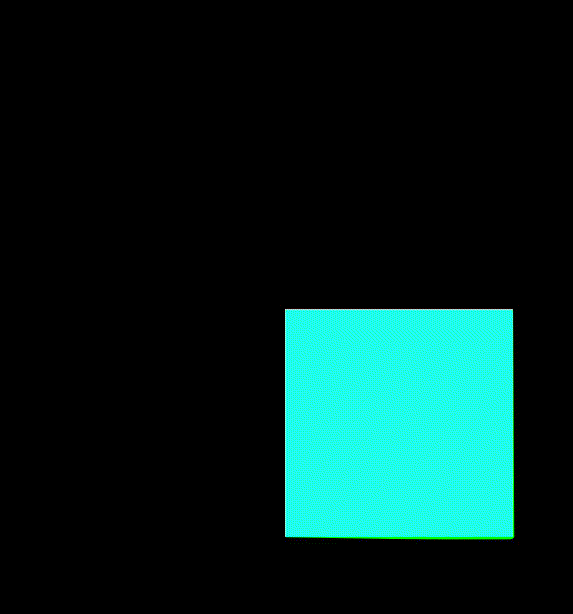

#
An experimental game engine written in Haskell using Raylib and the ECS design pattern with dependency injection (DI)
```haskell
heal :: Health -> Time -> Health
jump :: Keyboard -> Player -> Velocity -> Velocity
death :: Health -> Scene ()
birdDive :: Bird -> Velocity -> Angle
collision :: Collider -> Every Collider -> Scene ()
drawCubes :: Cube -> Maybe Position -> Maybe Color -> Scene ()
healEnemies :: Not Player -> Health -> Time -> Health
score :: Player -> Position -> Maybe (Score, Sound)
```
Note those systems are mere idealized suggestions to show the different kinds of things you can do, often you will end up in the Scene monad, and you will almost always need Time (delta time) for useful gameplay code

## Features
- Doesn't require component registries or Template Haskell,
  or an instance of a type class, any data type can be used as a component or resource.
- Simple yet rich and extensible query system (`Not`, `Every`, `Maybe`)
- Systems are functions
- Has been used to make a 2D game that [works on the Web](https://flappy-hs.netlify.app) via Wasm (apparently this is the first Haskell game made with h-raylib to ever properly run on the web) see [web build](#web-build) section

## Flappy Bird clone


`examples/flappy`
## Tutorial
The simplest application looks something like this:
```haskell
module Main (main) where
import Ents

main :: IO ()
main = runGame $ do
  gameLoop $ return ()
```
this opens an empty window, to customize it, you can add a `Window` resource by putting the following after `runGame` but before `gameLoop`:
```haskell
resource $ Window {
  title = "A title here",
  res = (256, 256),
  windowSize = RelativeSize 25,
  targetFps = 300,
  captureCursor = False,
  exit = False
}
```


to add visible things we need to spawn entities, we can spawn a cube by putting this right after the Window resource:
```haskell
spawn Cube (Position 0 0 2)
```


Entities are collections of components, `Cube` and `Position` are both built-in components, we can add a second entity with `Text` and `Color`
```haskell
spawn (Text "Hello World" 20 AlignLeft)
      (Position 10 10 0)
      (Color 100 100 255 255)
```


to make anything happen you use Systems, here's a system that changes `Color` over time:
```haskell
rainbow :: Color -> Time -> Color
rainbow (Color r g b a) timeStep
  | r == 255 && b == 0 && g < 255 =
      Color r (clamp (g + changeAmount)) b a
  | g == 255 && b == 0 && r > 0 =
      Color (clamp (r - changeAmount)) g b a
  | g == 255 && r == 0 && b < 255 =
      Color r g (clamp (b + changeAmount)) a
  | b == 255 && r == 0 && g > 0 =
      Color r (clamp (g - changeAmount)) b a
  | b == 255 && g == 0 && r < 255 =
      Color (clamp (r + changeAmount)) g b a
  | r == 255 && g == 0 && b > 0 =
      Color r g (clamp (b - changeAmount)) a
  | otherwise = Color 0 0 255 a
  where
    changeAmount = (20 * 30) * timeStep
    clamp x = max 0 (min 255 x)
```
And here's another system that changes `Rotation` and uses a custom component, `Spin`, to change how fast it goes:
```haskell
newtype Spin = Spin { speed :: Float }

spin :: Rotation -> Time -> Spin -> Rotation
spin (Rotation yaw pitch roll) t (Spin speed) =
  Rotation (yaw + (speed * t))
		   (pitch + (speed * t))
		   (roll + (speed * t))
```
After adding `Rotation` and `Color` and `Spin` to the cube, we can hook these systems up to the game loop with:
```haskell
gameLoop $ do
  system spin
  system rainbow
```



We can spawn a `Camera3D` to control the location of the 3D camera
```haskell
spawn (Camera3D 100) -- 100 is FOV
      (Position 0 0 0)
      (Rotation 5 0 0)
```
here are some rudimentary systems for moving the camera around using the mouse and keyboard:
```haskell
-- Add these imports, need containers and linear packages
import Linear
import qualified Data.Set as Set

moveSpeed, lookSens :: Float
moveSpeed = 5
lookSens = 30

movement :: Camera3D -> Keyboard -> Position -> Rotation -> Time -> Position
movement _ keys pos rot timeStep =
  pos + (sum (map dirVec (Set.toList (downKeys keys)))
          * Position timeStep timeStep timeStep
          * Position moveSpeed moveSpeed moveSpeed)
  where dirVec KeyW = toPosition (forward rot)
        dirVec KeyA = toPosition (right rot * (-1))
        dirVec KeyS = toPosition (forward rot * (-1))
        dirVec KeyD = toPosition (right rot)
        dirVec _ = toPosition 0
        toPosition (V3 x y z) = Position x y z

look :: Camera3D -> Mouse -> Rotation -> Time -> Rotation
look _ mouse rot timeStep =
  Rotation newYaw newPitch 0 where
    moveX = fst (mouseMovement mouse)
    moveY = snd (mouseMovement mouse)
    newYaw = yaw rot - (moveX * lookSens) * timeStep
    newPitch = max (-89) (min 89 (pitch rot - (moveY * lookSens) * timeStep))
```

For fun I wrote some code that spawns cubes and makes them fly around:
```haskell
replicateM_ 200 spawnRandomCube
```

https://github.com/user-attachments/assets/38d901bb-d850-45a4-b4f2-5956803bbd02

The code for this is under `examples/manycubes`

Although it would probably be easy to add other capabilities, rendering colored cubes is actually the only thing this engine can do in 3D,
the engine is obviously a much better fit for 2D as it is,
you can add 2D graphics using the `Sprite` component:
```haskell
spawn (Position 450 450 0)
      (Sprite "assets/dvdLogo.png")
      (Color 255 255 255 255)
      (Velocity 400 200 0)

bounce :: Position -> Velocity -> Color -> Scene (Velocity, Color)
bounce pos vel color = do
  let newVel = case () of
        _ | x pos + dvdLogoSprWidth > 1500 || x pos < 0 ->
              vel - Velocity (x vel * 2) 0 0
          | y pos + dvdLogoSprHeight > 1500 || y pos < 0 ->
              vel - Velocity 0 (y vel * 2) 0
          | otherwise -> vel
  if newVel /= vel then do
    r <- liftIO $ randomRIO (0, 255) :: Scene Float
    g <- liftIO $ randomRIO (0, 255) :: Scene Float
    b <- liftIO $ randomRIO (0, 255) :: Scene Float
    return (newVel, Color r g b 255)
  else
    return (vel, color)
```


The code for this is under `examples/dvdlogo`

## Animations
This engine has an Animation module (`Ents.Extra.Animation`) that allows you to animate the value of any component over time, by adding the `Animation` component:
```haskell
spawn (Sprite "assets/bird.png")
      (Position 20 20 0)
      (Animation [Frame (Sprite "assets/birdFlapUp.png"),
                  Frame (Sprite "assets/bird.png"),
                  Frame (Sprite "assets/birdFlapDown.png"),
                  Frame (Sprite "assets/bird.png")] (loop 0.5))
```


Frames are either of the form `(time, value)` where time is the percentage
of the animation at which the component has that value, or just value, in which case
the times are evenly spaced out (as above) You can also animate multiple components within the same animation, values can be instances of the `Animatable` type class in order to customize how they are interpolated, components such as `Position` and `Color` have instances that lerp:
```haskell
spawn Cube
      (Animation [Frame (0, Position 0 0 0),
                  Frame (50, Position 1 1 0),
                  Frame (80, Position 0 1.5 0),
                  Frame (100, Position 0 0 0),
                  Frame (0, Color 0 255 255 255),
                  Frame (50, Color 255 255 0 255),
                  Frame (100, Color 0 255 255 255)] (loop 1.5))
```



You'll need to add the `animate` system to your game loop, this system isn't perfect but it's good enough for animating sprites and making things like menu effects

## <a name="web-build"></a>Web build
`h-raylib` has had experimental support for running on the web for some time now,
when I tried it out, it had a few issues but after some slight tweaks,
it actually works fine for 2D games.

If you're wondering what happens if you try 3D, it renders wireframe shapes,
but RLGL is not available as far as I could tell because it's just not included
in the build. Absolutely no pressure from me on the author of `h-raylib` to add this
-- by the way, I don't care. if someone wants this it may be trivial to DIY, who knows..

the `clean-web-template` branch of this repository contains a setup with my small fixes for
getting an `h-raylib` application running on the web. (without this engine)

the `flappy-web-template` branch is the same except with the Flappy Bird example stuffed into it, the process wasn't nearly as smooth as I was hoping, to be honest I forgot `h-raylib` needs to hijack the main loop when running on the web, oh well, it does work, at least after I fixed a strange (non immediate) index out of bounds crash caused by `c'measureTextEx`, which I introduced recently to try and clean up the code, now it's even more messy, and I don't even care at this point!